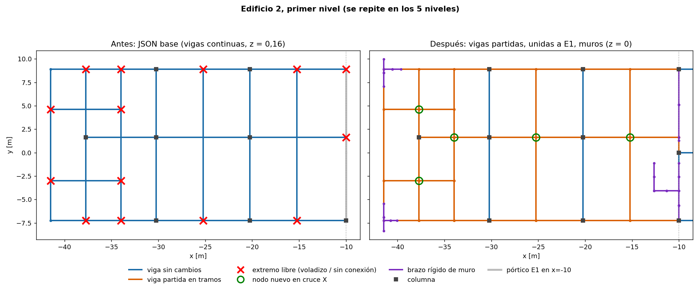
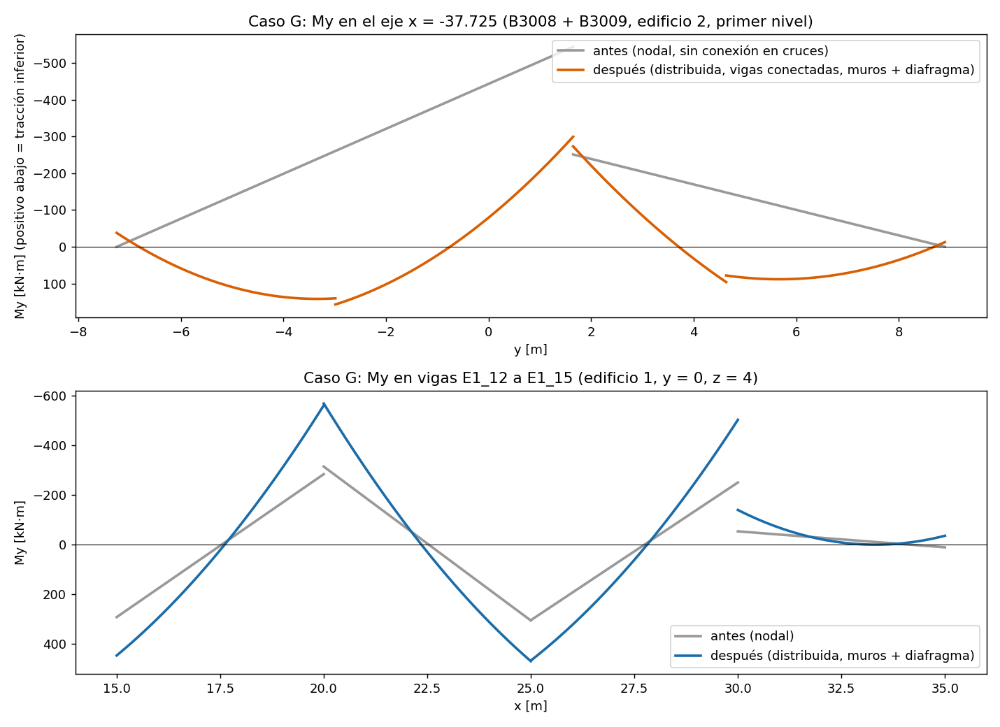

# Corrección del modelo estructural y del visualizador (semana 5)

**Alcance:** P1L3 (modelo OpenSees y casos de carga), P1L4 (exportador, JSON y scripts Unity) y los tests.
**Base:** `d4e1468` (origin/main) más el arreglo local de los botones de la carga móvil.
**Unidades:** kN, m, kN·m.

## 1. Qué estaba mal

| # | Problema | Efecto en los resultados |
|---|---|---|
| 1 | **Vigas continuas que no se cortan en las uniones.** En el edificio 2 las vigas pasan de largo por los nodos donde llega una viga transversal (uniones en T). Además, 25 pares de vigas se cruzan en planta sin nodo común (uniones en X). En el edificio 1 había 6 casos en T. | En OpenSees dos barras solo trabajan juntas si comparten un nodo. Las transversales quedaban **sueltas**: 25 componentes con empotramiento automático, que absorbían 253 kN en G, más 74 extremos libres trabajando en voladizo. |
| 2 | **Unión edificio 2 → edificio 1 en x = −10.** Las vigas de borde del edificio 2 (en y = 8,9 y y = 1,65) llegan al pórtico del edificio 1 sin conectarse. | 10 voladizos por piso de carga. |
| 3 | **Gravedad como cargas nodales qL/2.** | Corte constante y momento lineal en todos los vanos; no aparecían ni el momento de vano ni los de empotramiento. |
| 4 | **Sismo aplicado en un único nodo por piso,** el más cercano al centro de masas del conjunto. Sin diafragma, todo el corte del piso entraba por una sola unión. | El edificio 2 no recibía sismo. Aparecían fuerzas locales enormes (2.329 kN en una barra). |
| 5 | **Torsión con J = Iy + Iz,** que es el momento polar. | Sobrestima la rigidez torsional de una viga 30×80 unas 2,5 veces. |
| 6 | **Exportación de `eleForce` en ejes globales** (contrato legado). | Unity lo corregía rotando las fuerzas al cargarlas; el JSON quedaba ambiguo. |
| 7 | **`verify_building` y el reporte G usaban `eleForce` global.** Para una columna, `force[0]` es el corte en X, no el axial. | La verificación P-M de las columnas leía otra magnitud. |
| 8 | **El menú de P1L3 (`force_values_at`) interpolaba fuerzas globales** y sumaba la parábola inventada de `uniformLoad`. | La tabla del menú no correspondía al análisis. |
| 9 | **Nodos sin barras empotrados** (252 "apoyos"). | Ruido en `getFixedNodes` y en el visor. |
| 10 | **Desplazamientos exportados solo para C1–C3.** | La superposición interactiva de Unity dibujaba una deformada nula. |
| 11 | **Carga móvil:** auto-walk deshabilitado, botones −/+ que saltaban a 0 %/100 %, bloqueo por el panel de diagramas, objetos sin padre, `FindObjectsOfType` en cada cuadro. Además, **toda P se aplicaba a la viga seleccionada** aunque la persona estuviera lejos de ella. | Interacción rota y valores exagerados. |
| 12 | **Diagramas globales de V y M solo para vigas.** | Las columnas (sismo) no mostraban momento. |
| 13 | **Material COL70/70 rotulado "H-30"** mientras la curva usa f'c = 25 MPa (Po = 11.978 kN). | Etiqueta inconsistente. |

La figura muestra el edificio 2 antes y después:

## 2. Qué se cambió

### P1L3 `carga_viva_sismo.py`

- `corregir_conectividad(data)` devuelve el modelo corregido sin tocar el JSON base:
  - crea un nodo en cada cruce en X (25 en total, 5 por piso);
  - parte toda barra que tenga en su interior un nodo del mismo edificio: 99 barras partidas, 590 barras en total. Cada tramo conserva la sección y reparte D, L y el área tributaria en proporción a su longitud, así que la carga total se conserva. Los tramos llevan `parentId`/`parentTag` y el primero conserva el id original;
  - une los extremos libres del edificio 2 con el pórtico del edificio 1. Hay tres casos: fusión con un nodo coincidente (z = 16); partición de la columna o viga de E1 donde cae el nodo; o **enlace rígido** vertical (0,16 / 0,12 / 0,08 / 0,04 m) hasta la viga de E1, porque los niveles del edificio 2 están desfasados. La columna duplicada de E2 en y = −7,25 se dejó como estaba.
- `load_model_data()` se usa en el menú y en `main`. El resultado queda con una sola estructura apoyada, 0 extremos libres, 0 anclajes automáticos, y los nodos restringidos coinciden con los 26 apoyos declarados.
- `CARGAS_GRAVEDAD_DISTRIBUIDAS = True`: D y Q van como `eleLoad -beamUniform` (w = total/L, proyectado a los ejes locales). No se generan cargas nodales de gravedad, así que no se cuenta dos veces.
- Sismo: `F_i = C·W_i` en cada nodo del piso (W_i = D + 0,5Q tributario del nodo). Se mantienen el total (6.843,8 kN por dirección) y el reporte por piso. Se agrega `F_por_edificio_kN`.
- J de Saint-Venant para rectángulos (Roark).
- `run_and_extract` agrega `element_forces_local` (`localForce`), `reactions_all_fixed` y `auto_anchors`. `verify_building` y `gravity_case_report` usan acciones locales. `force_values_at` usa la misma fórmula que `FrameForces.Evaluate`.
- No se crean nodos sin barras.

### P1L4 `exportar_resultados_unity.py`

- Usa la geometría corregida. Exporta `localForce` y declara `p1l4.elementForceCoordinates = "local"`.
- Exporta los desplazamientos de G, Q, EX, EY, C1, C2 y C3.
- Agrega `p1l4.analysisModel` (hipótesis, reporte de conectividad y equilibrio por caso) y `p1l4.elementLoads` (las w aplicadas).
- Si alguna vez hiciera falta un anclaje automático, se exporta como apoyo rotulado. Hoy no hay ninguno.
- Corrige los rótulos de material de COL70/70 (H-25).

### Unity (scripts)

- `MobileLoadController`: se fusionó el arreglo local de botones y bloqueo con el commit `d4e1468`, y se agregó:
  - auto-walk real: botón **Caminar automático**; sobre una viga recorre de I a J y vuelve, y cualquier ajuste manual lo detiene;
  - regla de la palanca: sobre la viga llega `P·(1 − d/b)`, con b = A_trib/L; el panel muestra el porcentaje y la distancia;
  - objetos con padre y limpieza de restos una sola vez (sin destruir los vivos);
  - columnas y picker cacheados; logs de diagnóstico desactivados por defecto;
  - se quitó la regeneración del diagrama global en cada cuadro, que no cambiaba nada porque la carga móvil no se suma a OpenSees.
- `DiagramController`: V y M para todas las barras, dibujados en el plano local de la componente dominante. El momento queda del lado traccionado (My+ tracciona −z, Mz+ tracciona +y; verificado con un caso patrón). Picker cacheado.
- `SelectedBeamDiagramPanel`: acepta vigas, columnas y enlaces, y cachea la instancia usada por `BlocksPointer()`.
- `UnityData`/`FrameForces` no cambian: ya soportaban el contrato `local` y la carga distribuida.

## 3. Verificación

No hay OpenSeesPy disponible en este entorno (PyPI bloqueado), así que se agregó `P1L4/tests/mini_opensees.py`. Es un solver matricial en numpy que replica `ElasticBeam3d` + `LinearCrdTransf3d` (incluido `beamUniform`) y **se validó contra los resultados OpenSees guardados del modelo anterior**:

| Caso | Diferencia máxima en fuerzas de elemento | Diferencia en desplazamientos |
|---|---|---|
| G, Q, EX, EY, C1 (462 barras × 12 componentes) | ≤ 3,4·10⁻¹⁰ kN / kN·m | 1,4·10⁻¹⁴ m |

Nuevo test `python P1L4/tests/verificar_modelo.py` (con `--numpy` si falta OpenSeesPy): **26.601 comprobaciones PASS**.

- Conectividad: todo apoyado, 0 extremos libres, 0 anclajes, nodos fijos = 26 apoyos.
- Conservación: D del JSON base = D aplicado = reacción Rz = **24.397,98 kN**. Antes, las reacciones declaradas sumaban 24.144,5 kN; los 253,45 kN que faltaban se iban a los anclajes.
- Equilibrio global en los 7 casos (desbalance < 4·10⁻⁶ kN).
- Superposición C1–C3 = suma ponderada de G, Q, EX y EY (error < 10⁻⁶).
- El JSON coincide con una corrida nueva de `localForce` (590 barras × 7 casos).
- El diagrama cierra en J para todas las barras y casos (N, Vy, Vz, My, Mz).
- Caso patrón empotrado L = 6 m, q = 10 kN/m: My = −30 / +15 / −30.

Además:

- se actualizaron `referencia_opensees.py` (sin supuestos de "solo cargas nodales") y `UnityForceChecks.cs`, con las nuevas regresiones E1_84/C1 (My centro = 59,615, Mz = −0,369) y E1_272/C1 (N = −2.843,22), el contrato `local` declarado y la ausencia de anclajes;
- se hizo un smoke test del menú P1L3 (`--superposicion`, `--superposicion-3`, `--caso-g`, `--sismo-tablas`, `--verifica`, `--id`) sobre una copia del repo.

**Pendiente de ejecutar en Windows:** `./P1L4/tests/verificar_fuerzas_unity.ps1 -Python ...`, que compila los scripts C# con Unity 6000.6.0f1. En este entorno no hay compilador C#, así que los cambios en Unity no están compilados.

## 4. Muros estructurales y diafragma rígido (segunda etapa)

Los 75 paneles del JSON son **muros estructurales**: 6 muros en el edificio 1 y 9 en el edificio 2, cada uno de 5 paneles, de z = −4 a z = 16. Los tabiques no son elementos del modelo: están incluidos como carga muerta de terminaciones. Al unificar los edificios, `build_model` había dejado los muros fuera del análisis.

Cómo se modelan ahora (`agregar_muros` en P1L3):

- **Columna ancha.** Cada muro es una barra vertical en su centro con sección t × L, con el eje fuerte en el plano del muro, en cada nivel. Las barras son de tipo `muro_eq`: 83 en total.
- **Brazos rígidos.** En cada nivel se agregan brazos horizontales (franja t × 4 m, tipo `brazo_rigido`, 186 en total) hacia los extremos del muro y hacia los nodos del pórtico que caen sobre él. Los muros que forman una U o una L comparten sus nodos de esquina, así que trabajan como sección con alas.
- **Base.** La base de cada muro queda empotrada: hay 15 apoyos nuevos, 41 en total.
- **Niveles del edificio 2.** Los rótulos `E2_Z-8.17 … E2_Z11.83` están desplazados +4,17 m: el panel L1 va de −4,00 a 0,16. Los muros del eje x = −10 tienen nodos en los niveles de ambos edificios (0/0,16, 4/4,12, …), así que amarran las dos losas.
- **Diafragma rígido por nivel** (`rigidDiaphragm`, restricciones `Transformation`). Hay 9 niveles, de z = 0 a z = 16. El diafragma es necesario: los muros del edificio 1 y los del ascensor no reciben ninguna viga, así que sin él no toman carga lateral.
- **Peso propio** de columnas y muros (25 kN/m³) agregado al caso G y a la masa sísmica. Antes no estaba. El peso propio de las vigas sigue sin incluirse.
- **Demandas P-M de los muros** calculadas desde el análisis: P es la compresión en la base del panel y M el momento en el eje fuerte. Reemplazan la estimación anterior (área tributaria más reparto del corte basal). La curva P-M se muestra solo para el muro `W_DPRIME_OPENING_TO_3`, que es el que tiene curva calculada; los demás muros muestran su demanda sin curva.

Cuánto toman los muros (reacciones en sus bases):

| Caso | Total | Bases de muros | Fracción |
|---|---|---|---|
| G | 36.915,6 kN | 8.445,6 kN | 22,9 % |
| EX | 9.150,5 kN | 4.751,9 kN | 51,9 % |
| EY | 9.150,5 kN | 6.227,8 kN | 68,1 % |

Muro D' (`W_DPRIME_OPENING_TO_3`) en su base, con C1: P = 2.098 kN y M = 4.799 kN·m, frente a φMn ≈ 20.270 kN·m. Utilización ≈ 0,24.

## 5. Resultados: antes → corrección 1 → con muros

| Resultado | Antes | Vigas conectadas + carga distribuida | + muros, diafragma y peso propio |
|---|---|---|---|
| Nodos / barras | 549 / 462 | 578 / 590 | 779 / 859 (453 tramos de viga, 133 columnas, 4 enlaces, 83 `muro_eq`, 186 brazos) |
| Apoyos / anclajes automáticos | 26 / 25 (+252 nodos fijos) | 26 / 0 | 41 / 0 |
| G total | 24.144,5 kN a los apoyos (253 kN a los anclajes) | 24.398,0 kN | 36.915,6 kN (incluye 12.518 kN de peso propio) |
| Corte basal EX = EY | 6.843,8 kN | 6.843,8 kN | 9.150,5 kN |
| C1: uz mínimo | −0,0923 m | −0,0303 m | −0,0054 m |
| EX / EY: desplazamiento máx. | — | 0,0200 / 0,0332 m | 0,0145 / 0,0152 m |
| G: M máx. en viga | 840,7 kN·m (B3002) | 564,9 kN·m (B3008.2) | 378,2 kN·m (E1_13); B3008.2 baja a −138 kN·m |
| C1: M máx. en columna | 694,7 kN·m | 361,5 kN·m | 384,6 kN·m (E1_255) |
| C1: P máx. en columna | 2.620,8 kN | 2.843,2 kN | 3.001,3 kN (E1_272) |
| P-M de columnas con C1 | axial mal leído | 93 cumplen (máx. 0,67) | 93 cumplen (máx. 0,82, E1_255) |
| P-M con los lambdas del menú (EX = 1,0) | — | 14 no cumplen | 3 no cumplen (peor E1_255: 1,39) |

La verificación es `python P1L4/tests/verificar_modelo.py --numpy`: **38.859 comprobaciones PASS**. Incluye equilibrio con peso propio, superposición, contrato local, cierre de diagramas y que los muros tomen al menos el 5 % de G, EX y EY.

## 6. Tercera etapa: unión entre edificios, peso propio, torsión y curvas P-M

| Tema | Qué se encontró | Qué se hizo |
|---|---|---|
| **Columna duplicada en (−10, −7,25)** | `P1L2/scripts/unificar_edificios.py` pega la columna derecha del edificio 2 exactamente sobre el eje x = −10 del edificio 1. En esa esquina quedaban dos pilas de columnas en el mismo lugar: una sola columna física contada dos veces. | `eliminar_columnas_duplicadas()` quita C1003–C5003 (edificio 2) y su apoyo 364. Las vigas del edificio 2 que llegaban ahí se conectan a la columna E1 (se parte en 0,16 / 4,12 / 8,08 / 12,04 y se fusiona en z = 16). |
| **Desfase de niveles 0,16 → 0,04 m** | No es un error de dibujo. El edificio 2 real tiene pisos de 3,96 m (y 4,16 m en el subterráneo), y el edificio 1 paramétrico de 4,00 m; la unión alinea base y techo. | *Corregido en la revisión (§8):* los pisos del edificio 2 se alinean con los del edificio 1. |
| **Peso propio de vigas** | q_G = 635 kg/m² solo cubre la losa de 0,15 m y las terminaciones. | Se agrega el alma de cada viga, b·(h − 0,15)·25 kN/m, como carga distribuida en G y en la masa sísmica: 9,75 kN/m en V60/80. G total pasa de 36.916 a **60.354 kN**. |
| **Torsión accidental (NCh433, método estático)** | No existía. | En EX y EY, un momento por piso M_k = F_k · 0,10 · b_k · Z_k / H (b_k: ancho de la planta perpendicular al sismo; Z_k medido desde z = −4, H = 20 m), repartido como Mz nodal. Con el diafragma equivale a un momento por piso. La excentricidad llega a 2,0 m (EX) y 8,2 m (EY) en el techo. Se verificó el equilibrio de momentos. |
| **Curvas P-M de los muros** | Solo el muro D' tenía curva. | `wall_pm_curve_generic(t, L)`: interacción nominal por compatibilidad de deformaciones, con las mismas leyes de material y la misma armadura supuesta (2 capas φ12@200). Contra la curva de fibra del muro D' la diferencia es < 3 % hasta P/Pn0 ≈ 0,75. Hay **9 curvas nuevas**, una por sección, y los 75 paneles tienen curva en Unity. |
| **11 columnas que nacen sobre vigas** | Revisado con `edificio 1/CONTEXTO_EDIFICIO.md` §6–7: son voladizos definidos a propósito. E1_241 y E1_254 (voladizo Y−, pisos 1–2), E1_255 (columna extra X = 7,51 solo en el piso 2), E1_304–309 (voladizo X+, piso 4) y E1_310–311 (marco Y−). | Sin cambios: el modelo es correcto. |

### Resultados de esta etapa

| Resultado | Con muros (etapa 2) | Etapa 3 |
|---|---|---|
| Nodos / barras / apoyos | 779 / 859 / 41 | 779 / 857 / 40 (sin la columna duplicada) |
| G total | 36.916 kN | 60.354 kN (35.956 kN de peso propio) |
| Corte basal EX = EY | 9.150 kN | 13.843 kN |
| Muros en G / EX / EY | 23 / 52 / 68 % | 19,5 / 52,2 / 59,9 % |
| EX / EY: desplazamiento máx. | 14,5 / 15,2 mm | 22,2 / 32,8 mm (con torsión accidental) |
| C1: M máx. en viga | 603,6 kN·m | 881,6 kN·m (E1_10) |
| C1: P máx. en columna | 3.001 kN | 4.064 kN (E1_272) |
| P-M de columnas | 0 fallas (C1) | **E1_255 no cumple con C1 (1,34) ni con C2 (1,24)**; C3 cumple |

`verificar_modelo.py --numpy`: **38.771 comprobaciones PASS**. Incluye la columna duplicada eliminada, la torsión aplicada y el equilibrio con todo el peso propio.

**Hallazgos de diseño** (no son errores del modelo):

- **E1_255** es la columna que nace sobre una viga en (7,51; −7,25), entre z = 4 y 8. Tiene poco axial (≈ 75 kN) y mucho momento (≈ 640 kN·m con C1), porque recibe el giro de la viga que la sostiene. No cumple el P-M con C1 y C2.
- **Alas del muro en U del edificio 1** (`W_0.25x1.57`, extremos de los muros principales): en la base quedan en tracción, cerca de −780 kN con C1–C3, por el volcamiento de la U. Eso supera la tracción pura de la armadura supuesta (≈ −760 kN con φ12@200). Necesitan más acero en los bordes.
- **Muro del ascensor `W_0.30x2.65`:** utilización 0,96 con C1.

## 8. Revisión final (dos correcciones)

1. **Pisos desfasados entre los edificios.** Mantener los pisos del edificio 2 a 4–16 cm de los del edificio 1, unidos por barras de 4–16 cm (enlaces rígidos y tramos cortos de muro y columna), dejaba dos losas casi superpuestas, cada una con su diafragma. Esas barras cortas transmitían cortes artificiales de hasta **16.900 kN**, más que el corte basal total. Además, OpenSees **ignora sin avisar** los nodos de un `rigidDiaphragm` que no estén exactamente en el plano del maestro.
   - **Corrección:** `alinear_niveles_edificio2()` lleva las cotas 0,16 / 4,12 / 8,08 / 12,04 a 0 / 4 / 8 / 12. Es lo mismo que ya hacía el visor Unity al dibujar (`SnapToBuilding1Level`).
   - **Consecuencias:** ya no hay enlaces rígidos, las vigas del edificio 2 se funden con los nodos del edificio 1 y queda un solo diafragma por piso (5 niveles).
   - **Protección:** `build_model` ahora aborta si un diafragma tiene nodos a distinta cota.
   - **Resultado:** el corte máximo en una barra baja a 1.176 kN (muro D') y el equilibrio cierra a 10⁻⁹ kN.
2. **Razón P-M en Unity.** Cuando la demanda caía fuera de la curva (más tracción que la de la armadura), `GetCapacityRatio` tomaba el punto más cercano y podía mostrar **C = 0**, aparentando que la sección cumplía. Ahora `UnityData.CapacityRatio`, compartida por `PMPanel` y `ElementSelectable`, devuelve "fuera de curva / no cumple". Se agregó una prueba en `UnityForceChecks.cs`.

### Estado final

| Resultado | Valor |
|---|---|
| Nodos / barras / apoyos | 759 / 817 (453 vigas, 124 columnas, 75 `muro_eq`, 165 brazos) / 40 |
| G total / corte basal | 60.354 kN / 13.847 kN |
| Muros en G / EX / EY | 19,2 / 51,9 / 58,3 % |
| Deriva de entrepiso en el CM (EX, EY) | máx. 1,56 ‰, bajo el límite de 2 ‰ de la NCh433 |
| P-M de columnas | E1_255 no cumple con C1 (1,35) ni con C2 (1,25); las demás cumplen |
| P-M de muros (225 paneles × combinación) | 6 fuera de la curva o con C > 1: en la base, los muros del ascensor (tracción hasta −1.500 kN con C2) y las alas del muro en U del edificio 1 (≈ −800 kN), más el muro `W_DPRIME_ELEVATOR_TOP` (1,03 con C1) |
| Apoyos en tracción (C1–C3) | bases de esos mismos muros (hasta −1.463 kN) y la columna 166 (−120 kN con C3) |
| `verificar_modelo.py --numpy` | **36.971 comprobaciones PASS**; JSON reproducible byte a byte |

## 9. Carga móvil: reparto losa → vigas

Antes, la viga seleccionada solo recibía carga si la persona estaba a menos de un ancho tributario de ella (regla de la palanca sobre una franja). Una persona en el centro de un paño no cargaba las vigas del borde.

Ahora `MobileLoadController.ComputeSlabDistribution()` busca, desde la posición de la persona, el apoyo más cercano (viga o muro) en +X, −X, +Z y −Z, y reparte P con pesos 1/d⁴. No usa los bordes de los paños de losa, porque el 28 % de esos bordes no tiene viga (son subdivisiones del paño o bordes de muro). En el centro de un paño este reparto reproduce Rankine-Grashof: en una bahía de 5 × 8,9 m, el 91 % va a las vigas del lado corto. Si la persona pisa una viga, esa viga recibe el 100 %.

La viga seleccionada recibe su fracción como carga puntual en la proyección de la persona. El panel lista los 4 apoyos con su % y kN, y verifica que la suma sea 100 %. Réplica en Python sobre la geometría real: en 1.130 puntos al azar sobre las losas se encontraron siempre 4 apoyos.

### 9.1 Segunda corrección (la carga seguía sin llegar bien)

Se encontraron cinco fallas en `MobileLoadController.cs` / `ElementPicker.cs`:

1. `SyncSelectedElement()` se ejecutaba en cada frame y reponía `slabBoundsOverride = false`: al hacer clic en una losa, la persona volvía a la viga en el frame siguiente. Ahora solo reacciona cuando cambia la selección.
2. Al hacer clic en una losa, `ElementPicker` deseleccionaba la viga y se cerraba su panel de diagramas. Ahora, con el panel de carga móvil abierto, el clic en la losa solo mueve a la persona y la viga sigue seleccionada.
3. El clic en la losa confinaba los deslizadores y la caminata automática a ese paño. Ahora abarcan todo el piso del nivel.
4. Los apoyos se calculaban antes de mover a la persona (un frame de atraso) y las reacciones de columnas usaban 1/d² desde la persona, sin relación con las vigas cargadas. Ahora las columnas reciben las reacciones de extremo de las vigas cargadas (viga biempotrada con carga puntual: R_I = P·b²(L+2a)/L³).
5. Fuera de la losa la persona seguía cargando vigas por la regla de la palanca. Ahora solo carga si pisa la viga (≤ 0,30 m).

Réplica en Python: en 678 puntos al azar sobre las losas, la suma de reacciones es siempre 100 % de P y ninguna es negativa.

### 9.2 Tercera corrección: el clic en la losa cambiaba la viga seleccionada

`ElementPicker` buscaba primero una barra en **todo** el rayo del clic. Como el rayo atraviesa la losa, casi siempre encontraba una viga o columna del piso de abajo y la seleccionaba. El panel de diagramas pasaba a mostrar esa otra barra, lejos de la persona, y el momento no cambiaba.

Ahora, con la carga móvil activa, decide el primer objeto que toca el rayo:

- Si es una losa, el clic solo mueve a la persona.
- Si es la viga ya seleccionada, la persona se para en ese punto.
- Si es otra barra, se selecciona esa barra.

Además, al seleccionar una viga la persona aparece en su centro. El panel "Diagramas de viga" dibuja en gris la curva sin la persona (solo OpenSees) y muestra el aporte máximo de la persona en My y Vz.

### 9.3 Reparto por franjas cruzadas (la viga solo reaccionaba si la persona la pisaba)

Con pesos 1/d⁴ el reparto era demasiado abrupto: a pocos metros de la viga casi toda la carga iba al apoyo más cercano de la otra dirección, y la viga no recibía nada. En vigas de borde, además, faltaba el apoyo del otro lado.

Ahora se usa el método de las franjas cruzadas:

- Por la persona pasan dos franjas de losa simplemente apoyadas, una en X y otra en Z, cada una entre sus dos apoyos más cercanos.
- La carga se reparte entre las franjas según su rigidez bajo la carga, k = L/(a·b)², porque la flecha de cada franja vale P·a²·b²/(3EIL).
- Cada franja reparte su parte entre sus dos apoyos por la regla de la palanca.
- Si la persona está sobre un apoyo (a menos de 2 cm), ese apoyo recibe el 100 %.

Resultados en E1_13 (bahía de 5 × 8,9 m, z = 4 m): 100 % sobre la viga, 91 % a 0,25 m, 47 % a 1 m, 21 % a 2 m y 12 % a 3 m. Sobre la geometría real, a 1 m de cada viga la mediana es 52 %; antes era 95 % a 1 m y 0 % un poco más lejos. En 2.000 puntos al azar sobre las losas, la suma siempre da 100 % y no hay fracciones negativas.

## 7. Lo que sigue pendiente

1. **Armadura real de los muros.** Las curvas P-M suponen φ12@200 en todos los muros, incluidos los de 0,6 m. Hay que confirmarla con los planos.
2. **Signo de la torsión accidental.** Se aplica solo con signo +. La NCh433 pide revisar ±; faltarían 2 casos adicionales (o el signo − en las combinaciones).
3. **Diafragma rígido:** anula el axial en las vigas. Es lo esperado, pero conviene comentarlo en el informe.
4. **Scripts C# sin compilar.** Falta compilar en Unity y correr `verificar_fuerzas_unity.ps1`.
5. **Archivos históricos sin regenerar:** `P1L3/semana3.py` y `P1L3/resultados/` (semana 3).
